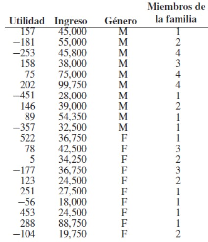

### Primer ejercicio

En http://www.statsci.org/data/oz/physical.html, se encuentra un conjunto de datos de mediciones realizadas por M. Larner en 1996. Estas medidas incluyen la masa corporal y varios diámetros. 

```{r}

# Cargar datos
datos = read.delim("http://www.statsci.org/data/oz/physical.txt", header = TRUE) 

```


**a)** Construya una regresión lineal para predecir la masa corporal a partir de estos diámetros. Grafique el residuo contra los valores ajustados para su regresión

```{r}
x = datos$Mass
solucion = lm(x~datos$Fore+datos$Bicep+datos$Chest+datos$Neck+datos$Shoulder+datos$Waist+datos$Height+datos$Calf+datos$Thigh+datos$Head)
summary(solucion)
residuos <- resid(solucion)

plot(predict(solucion), residuos, xlab = "Valores ajustados", ylab = "Residuos", main = "Gráfico de residuos")
abline(h = 0, col = "black")

```


**b)** Ahora haga una regresión de la raíz cúbica de la masa contra estos diámetros. Grafique el residual contra los valores ajustados en los dos sistemas de coordenadas: las coordenadas de la raíz cúbica y en las coordenadas originales.

```{r}
x1 = datos$Mass^(1/3)
solucion1 = lm(x1~datos$Fore+datos$Bicep+datos$Chest+datos$Neck+datos$Shoulder+datos$Waist+datos$Height+datos$Calf+datos$Thigh+datos$Head)
summary(solucion1)
residuos1 <- resid(solucion1)

plot(predict(solucion), residuos, xlab = "Valores ajustados", ylab = "Residuos", main = "Gráfico de residuos")
abline(h = 0, col = "black")

plot(predict(solucion1), residuos1, xlab = "Valores ajustados", ylab = "Residuos", main = "Gráfico de residuos")
abline(h = 0, col = "black")

```

**c)** Analice los resultados obtenidos, y use los diagramas obtenidos en los numerales a y en b para explicar qué regresión es mejor. Realice la explicación de forma clara y justifique su respuesta

Se analizó el valor de R cuadrado y se observa que son resultados cercanos, por lo que pasó a realizar un análisis gráfico en el que se visualiza que los residuales de la segunda regresión están más cercanos a cero, luego, para reforzar esto, se revisan los valores obtenidos para el residual estándar error donde se tiene un valor de 2.287 Al usar los datos originales y un valor de 0.04444 Para los datos con la raíz. De esta forma, puede decirse que el mejor modelo es que el emplea la raíz de los datos de masa corporal.

### Segundo ejercicio

Se efectuó un estudio para determinar si el género del titular de la tarjeta de crédito era un factor importante en la generación de utilidades para cierta empresa de tarjetas de crédito. Las variables consideradas fueron el ingreso, el número de miembros de la familia y el género del titular de la tarjeta. Los datos son los siguientes:



**a)** Ajuste un modelo de regresión lineal usando las variables disponibles. Con
base en el modelo ajustado, ¿la empresa preferiría clientes del género
masculino o del femenino?

```{r}
utilidad <- c(157,-181, -253, 158, 75, 202, -451, 146, 89, -357, 522, 78, 5, -177, 123, 251, -56, 453, 288, -104) 
ingreso<- c(45000, 55000, 45800, 38000, 75000, 99750, 28000, 39000, 54350, 32500, 36750, 42500, 34250, 36750, 24500, 27500, 18000, 24500, 88750, 19750) 
GeneroM<- c(0,0,0,0,0,0,0,0,0,0,1,1,1,1,1,1,1,1,1,1)
miembros<- c(1,2,4,3,4,4,1,2,1,1,1,3,2,3,2,1,1,1,1,2)

df <- data.frame(Utilidad = utilidad, Ingreso = ingreso, Genero = GeneroM, Miembros = miembros)
matriz_cor <- cor(df)
print(matriz_cor)

```

### Ajustar el modelo de regresión lineal

```{r}
modelo <- lm(Utilidad ~ Ingreso + Miembros + Genero, data = df)
```

### Obtener los resultados

```{r}
resultados <- summary(modelo)$coefficients
```

### Crear la tabla

```{r}
tabla <- data.frame(Variable = rownames(resultados),
                    Estimate = resultados[, 1],
                    Standard_Error = resultados[, 2],
                    t_value = resultados[, 3],
                    p_value = resultados[, 4])
print(tabla)

```

### Calcular el coeficiente de determinación (R cuadrado)

```{r}
r_cuadrado <- summary(modelo)$r.squared
r_cuadrado
```
La ecuacion del modelo es:

$$funcion = 30.08 + 0.00543\cdot Ingreso-49.24\cdot Miembros-236.7\cdot Genero$$

El coeficiente que acompaña la variable GeneroM es 236,7258 (se usa como nivel de referencia el género masculino M=0), este valor indica la diferencia esperada en la utilidad entre el género masculino y el género femenino: manteniendo constantes el ingreso y el número de miembros de la familia, el modelo predice que las personas de género femenino generan 236,7258 más de utilidad que si es hombre. Por lo tanto, se podría inferir que la empresa preferiría clientes del género femenino. Sin embargo, analizando los valores de $R^{2}$ y $R^{2}$ ajustado, que son de 0.3075 y 0.1777 respectivamente, se deduce que el modelo no representa de buena manera los datos, lo ideal es que el valor de R se acerque a 1 (para que sea un buen ajuste), en este caso, el 17.77% de la variabilidad en el valor de utilidad es explicada por el modelo.

**b)** ¿Diría usted que el ingreso fue un factor importante para explicar la
variabilidad de la utilidad?

Como el valor de significancia es de 0.3075 podemos concluir,que el ingreso no fue un factor importante para explicar la variabilidad 
de la utilidad ya que nuestro valor p es mayor que 0.05 (0.0649) , por lo tanto se debería considerar otras variables o factores adicionales para mejorar la capacidad predictiva del problema. Además, visualizando la matriz de correlación se puede apreciar que para las variables de utilidad e ingreso se tiene un valor de 0.2033, por lo que no hay una fuerza de asociación tan alta entre dichos valores.


